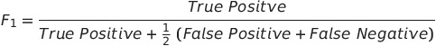
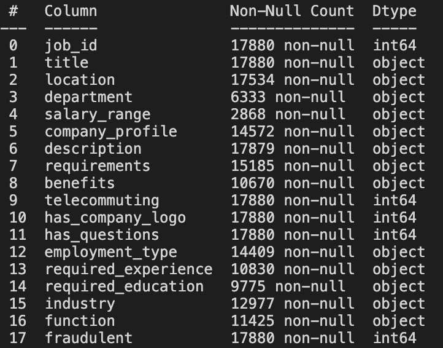
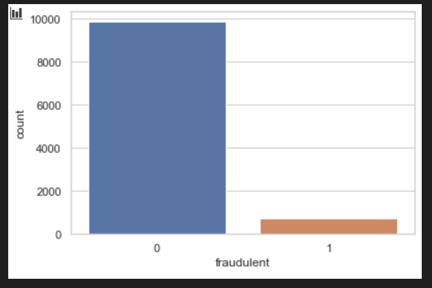
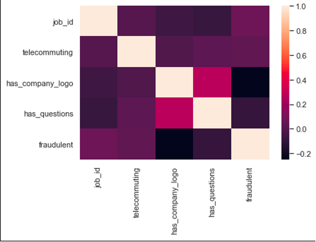

# Fake-Job-Posting-Prediction

- Project Overview
Employment scams are on the rise. According to CNBC, the number of employment scams doubled in 2025 as compared to 2023 and 2024. The current market situation has led to high unemployment. Economic stress and the impact of the coronavirus have significantly reduced job availability and the loss of jobs for many individuals. A case like this presents an appropriate opportunity for scammers. Many people are falling prey to these scammers using the desperation that is caused by an unprecedented incident. Most scammer do this to get personal information from the person they are scamming. Personal information can contain address, bank account details, social security number etc. I am a university student, and I have received several such scam emails. The scammers provide users with a very lucrative job opportunity and later ask for money in return. Or they require investment from the job seeker with the promise of a job. This is a dangerous problem that can be addressed through Machine Learning techniques and Natural Language Processing (NLP).

This project uses data provided from Kaggle. This data contains features that define a job posting. These job postings are categorized as either real or fake. Fake job postings are a very small fraction of this dataset. That is as excepted. We do not expect a lot of fake jobs postings. This project follows five stages. The five stages adopted for this project are –

Problem Definition (Project Overview, Project statement and Metrics)

- Data Collection

- Data cleaning, exploring and pre-processing

- Modeling

- Evaluating

**Problem Statement**

This project aims to create a classifier that will have the capability to identify fake and real jobs. The final result will be evaluated based on two different models. Since the data provided has both numeric and text features one model will be used on the text data and the other on numeric data. The final output will be a combination of the two. The final model will take in any relevant job posting data and produce a final result determining whether the job is real or not.


📊 Dataset

Source: [Fake Job Posting Dataset (Kaggle)](https://www.kaggle.com/datasets/shivamb/real-or-fake-fake-jobposting-prediction)

- Contains ~18,000 job postings with features like:

title, location, department, salary_range, company_profile, description, requirements, benefits

Binary target column: fraudulent (0 = Real, 1 = Fake)


**Metrics**

The models will be evaluated based on two metrics:

1. Accuracy: This metric is defined by this formula - 

   

As the formula suggests, this metric produces a ratio of all correctly categorized data points to all data points. This is particularly useful since we are trying to identify both real and fake jobs unlike a scenario where only one category is important. There is however one drawback to this metric. Machine learning algorithms tend to favor dominant classes. Since our classes are highly unbalanced a high accuracy would only be a representative of how well our model is categorizing the negative class (real jobs).

F1-Score: F1 score is a measure of a model’s accuracy on a dataset. The formula for this metric is –  


F1-score is used because in this scenario both false negatives and false positives are crucial. This model needs to identify both categories with the highest possible score since both have high costs associated to it.


**Analysis**
------------------------------------------------------------------------------------------------------------------------------------------------------------------------------
**Data Exploration**
------------------------------------------------------------------------------------------------------------------------------------------------------------------------------
The data for this project is available at Kaggle - https://www.kaggle.com/shivamb/real-or-fake-fake-jobposting-prediction. The dataset consists of 17,880 observations and 18 features

The data is combination of integer, binary and textual datatypes. A brief definition of the variables is given below:

## 📂 Dataset Description

| #  | Variable            | Datatype | Description |
|----|---------------------|----------|-------------|
| 1  | job_id              | int      | Identification number given to each job posting |
| 2  | title               | text     | A name that describes the position or job |
| 3  | location            | text     | Information about where the job is located |
| 4  | department          | text     | Information about the department this job is offered by |
| 5  | salary_range        | text     | Expected salary range |
| 6  | company_profile     | text     | Information about the company |
| 7  | description         | text     | A brief description about the position offered |
| 8  | requirements        | text     | Pre-requisites to qualify for the job |
| 9  | benefits            | text     | Benefits provided by the job |
| 10 | telecommuting       | boolean  | Is work from home or remote work allowed |
| 11 | has_company_logo    | boolean  | Does the job posting have a company logo |
| 12 | has_questions       | boolean  | Does the job posting have any questions |
| 13 | employment_type     | text     | Categories – Full-time, part-time, contract, temporary, other |
| 14 | required_experience | text     | Internship, Entry Level, Associate, Mid-senior level, Director, Executive, Not Applicable |
| 15 | required_education  | text     | Bachelor’s degree, high school degree, unspecified, associate degree, master’s degree, certification, some college coursework, professional, some high school coursework, vocational |
| 16 | industry            | text     | The industry the job posting is relevant to |
| 17 | function            | text     | The umbrella term determining a job’s functionality |
| 18 | fraudulent          | boolean  | **Target variable** → 0: Real, 1: Fake |


Since most of the datatypes are either Booleans or text a summary statistic is not needed here. The only integer is job_id which is not relevant for this analysis. The dataset is further explored to identify null values.




Variables such as department and salary_range have a lot of missing values. These columns are dropped from further analysis.

After initial assessment of the dataset, it could be seen that since these job postings have been extracted from several countries the postings were in different languages. To simplify the process this project uses data from US based locations that account for nearly 60% of the dataset. This was done to ensure all the data is in English for easy interpretability. Also, the location is split into state and city for further analysis. The final dataset has 10593 observations and 20 features.

The dataset is highly unbalanced with 9868 (93% of the jobs) being real and only 725 or 7% of the jobs being fraudulent. A countplot of the same can show the disparity very clearly.





**Exploratory Analysis**

The first step to visualize the dataset in this project is to create a correlation matrix to study the relationship between the numeric data.

Figure 4. Correlation matrix

The correlation matrix does not exhibit any strong positive or negative correlations between the numeric data.




**Missing Value Percentage**
```
def missing_data(data):
    absolute_missing = data.isnull().sum().sort_values(ascending = False)
    percentage_missing = np.round((data.isnull().sum() / data.shape[0] * 100),2).sort_values(ascending = False)
    missing_dataframe = pd.concat([absolute_missing,percentage_missing],axis = 1,keys = ['Total Count','Percentage'])
    return missing_dataframe[missing_dataframe['Total Count'] > 0]
```

| Column Name         | Total Count | Percentage |
|--------------------|------------|-----------|
| department          | 11547      | 64.58%    |
| required_education  | 8105       | 45.33%    |
| benefits            | 7212       | 40.34%    |
| required_experience | 7050       | 39.43%    |
| function            | 6455       | 36.10%    |
| industry            | 4903       | 27.42%    |
| employment_type     | 3471       | 19.41%    |
| company_profile     | 3308       | 18.50%    |
| requirements        | 2696       | 15.08%    |
| location            | 346        | 1.94%     |
| description         | 1          | 0.01%     |

**Exploratory Analysis of Categorical Features vs Fraudulent Jobs**

The target variable fraudulent is converted to a categorical type for better visualization.
We analyze the relationship between telecommuting, has_company_logo, and has_questions with fraud.
Count plots are created to show the distribution of each variable across fraudulent and non-fraudulent jobs.
This helps identify patterns or differences in job postings that are likely to be fraudulent.


**Text Preprocessing**

The following steps are taken for text processing:


- Tokenization: The textual data is split into smaller units. In this case the data is split into words.
- To Lower: The split words are converted to lowercase
- Stopword removal: Stopwords are words that do not add much meaning to sentences. For example: the, a, an, he, have etc. These words are removed.
- Lemmatization: The process of lemmatization groups in which inflected forms of words are used together.

**Handling Imbalanced Dataset**

- In our dataset, the target variable fraudulent is imbalanced: there are more non-fraudulent job postings than fraudulent ones.

- Imbalanced data can bias models toward the majority class, reducing prediction performance for the minority class.
  
- To address this, techniques like SMOTE, Random Oversampling, or class weights can be used.

``` jupyter
  
from imblearn.over_sampling import SMOTE
  
from sklearn.model_selection import train_test_split

X = data.drop('fraudulent', axis=1)
y = data['fraudulent']

X_train, X_test, y_train, y_test = train_test_split(X, y, test_size=0.2, random_state=42)

smote = SMOTE(random_state=42)
X_train_res, y_train_res = smote.fit_resample(X_train, y_train)

print("Original class distribution:\n", y_train.value_counts())
print("Resampled class distribution:\n", y_train_res.value_counts())

```

**Algorithms and Techniques**

Based on the initial analysis, both textual and numerical features are used for modeling. The final dataset includes:

- telecommuting

- fraudulent

- ratio: Fake-to-real job ratio by location

- text: Combined text from title, location, company_profile, description, requirements, benefits, required_experience, required_education, industry, and function

- character_count: Word count of textual data

- Textual data is preprocessed (cleaning, tokenization, and vectorization) before modeling.

**Algorithms applied:**

- Logistic Regression – baseline linear model for classification.

- Random Forest – ensemble of decision trees to improve accuracy and reduce overfitting.

- XGBoost – gradient boosting method optimized for performance and imbalanced datasets.

Models are evaluated using accuracy, F1-score, and other metrics on both text and numerical features.


**Model Evaluation**

The model’s performance on the test set is summarized below:

| Class         | Precision | Recall | F1-Score | Support |
| ------------- | --------- | ------ | -------- | ------- |
| 0 (Non-Fraud) | 0.99      | 0.99   | 0.99     | 3395    |
| 1 (Fraud)     | 0.88      | 0.75   | 0.81     | 181     |


**Accuracy:** 0.98 – overall percentage of correctly classified jobs.

**Macro Average:** Treats each class equally, F1-score = 0.90.

**Weighted Average:** Takes class imbalance into account, F1-score = 0.98.

**Interpretation**:

- The model performs very well on the majority class (non-fraudulent jobs).

- Recall for the minority class (fraudulent jobs) is lower (0.75), indicating some fraud cases are missed.

- Overall, the model is highly accurate but could be improved for detecting fraudulent postings.

**Justification**

- The final model outperforms the baseline, achieving very high accuracy in identifying real jobs.

- Detection of fraudulent jobs can still be improved due to class imbalance.

**Reflection**

- Fake job postings are a real-world challenge, and this project provides a potential solution.

- Textual data is preprocessed, and relevant numerical features are used to optimize results.

- Outputs from multiple models are combined to reduce bias toward the majority class.

- Key insights:

- Certain locations, e.g., Bakersfield, CA, have extremely high fake-to-real job ratios (15:1).

- Most entry-level jobs targeting candidates with a bachelor’s or high school degree appear fraudulent.

- The most challenging part was preprocessing textual data, which required extensive cleaning.

**Improvement**

- The dataset is highly imbalanced, favoring real jobs.

- Techniques like SMOTE or other oversampling methods can generate synthetic minority samples.

- A more balanced dataset would likely improve detection of fraudulent postings.

